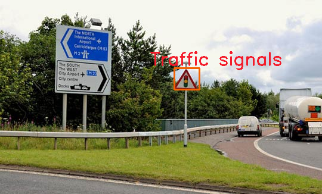
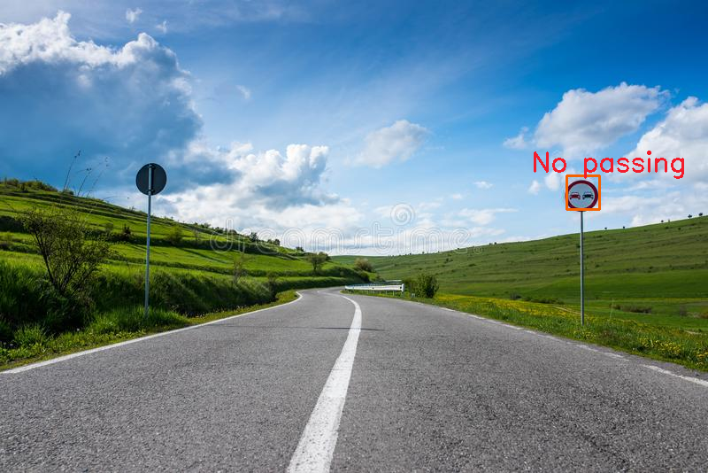

# **PJI**

## **TRAFFIC SIGN RECOGNITION USING DEEP LEARNING ALGORITHM**

### **Submitted by** - Sankari Balasubramaniyan

### **OBJECTIVE**

The main objective of the project is to recognition different traffic signs. The project has a two-stage methodology to make the recognition possible, 

a). Accurate localisation of traffic signs using YOLOv3 tiny model, 

b). Further classification of detected traffic sign image among various classes using a custom built light weight convolutional neural network.

### **SYSTEM REQUIREMENTS**

#### **LAPTOP**
-  Python 3.6.9
- Tensorflow 2.9.0, keras 2.8
- Opencv4

#### **NVIDIA JETSON NANO**
-  Python 3.6.9
- Tensorflow 2.0.0, keras 2.2.4, h5py 2.10.0
- Opencv4
- Jetpack v43 (in Nvidia GPU)
- Cuda

### **EXECUTION**

#### **LAPTOP**
- cd Traffic_sign_recognition
- ./sign_detector_video.py  (to detect signs in video)
- ./sign_detector_image.py (to detect signs in image)

#### **NVIDIA JETSON NANO**
- cd Traffic_sign_recognition_gpu
- ./sign_detection_threaded (to detect signs in video)
- ./sign_detection_image.py (to detect signs in image)

### **RESULT**
- The detection model localises the traffic signs in the video/image and produces a bounding box around it. The FPS of detection model was calculated to around 38. The model was trained to the highest of 78% mAP@0.5 
- The classification model predicts the label of the given traffic sign. The inference time taken by the model is around 16 in Nvidia jetson nano. The model was evaluated to have an accuracy of 94.74% when tested against new datasets. 

### **EXAMPLE OUTPUT**

